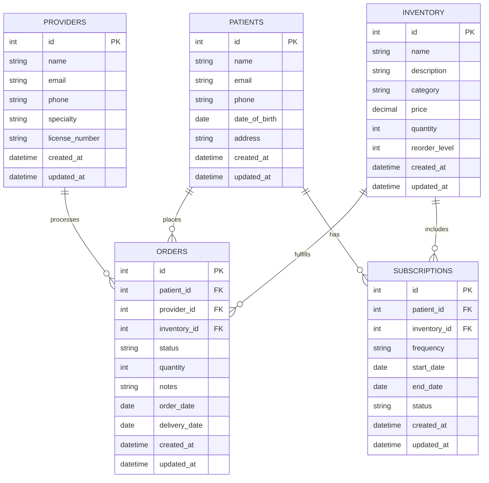

# Healthcare System Architecture

## Architecture Overview

### Directory Organization

```
app/
 ├── Http/
 │   ├── Controllers/
 │   │   ├── OrderController.php
 │   │   ├── ProfileController.php
 │   │   └── ProductController.php
 │   ├── Middleware/
 │   │   ├── AuthMiddleware.php
 │   │   └── RoleMiddleware.php
 │   ├── Requests/
 │   │   ├── StoreProductRequest.php
 │   │   └── StoreOrderRequest.php
 │   ├── Policies/
 │   │   └── OrderPolicy.php
 │   └── Services/
 │       └── OrderService.php
 ├── Mail/
 │   └── OrderPlaced.php
 ├── Models/
 │   ├── Order.php
 │   ├── Product.php
 │   └── User.php
 └── ...

database/
 ├── migrations/
 └── seeders/

resources/
 ├── views/
 │   ├── products/
 │   ├── orders/
 │   └── emails/
 └── components/

routes/
 └── web.php
```

---

### Core Architectural Components

1. **Requests (`app/Http/Requests/`)**
   - Handles **input validation** and **authorization** for HTTP requests.
   - Keeps controllers clean and maintainable.
   - Redirects automatically on validation failure.
   - Example:
     - `StoreOrderRequest.php`
     - `StoreProductRequest.php`

2. **Policies (`app/Policies/`)**
   - Centralizes **authorization logic** for models/resources.
   - Defines user actions like `view`, `create`, `update`, `delete`.
   - Example: `OrderPolicy.php`

3. **Services (`app/Services/`)**
   - Contains **business logic** not suitable for controllers/models.
   - Promotes **reusability** and **testability**.
   - Example: `OrderService.php` for order processing, inventory updates, notifications.

4. **Controllers (`app/Http/Controllers/`)**
   - Handles HTTP requests and delegates work to services.
   - Follows **RESTful conventions**: `index`, `create`, `store`, `show`, `edit`, `update`, `destroy`.
   - Example:
     - `OrderController.php`
     - `ProductController.php`
     - `ProfileController.php`

5. **Models (`app/Models/`)**
   - Eloquent models representing database tables: `User`, `Product`, `Order`.

6. **Database Migrations (`database/migrations/`)**
   - Version-controlled schema definitions.
   - Timestamped for proper ordering.

7. **Views (`resources/views/`)**
   - Blade templates organized by feature/component.

8. **Routes (`routes/web.php`)**
   - Handles web requests with session/CSRF protection.
   - API routes are stateless and may use token authentication.

---

### Key Design Decisions

- **Separation of Concerns:** Clear distinction between models, views, controllers, and services.
- **API-First Approach:** Backend serves web and API requests; versioned endpoints for future-proofing.
- **Frontend Architecture:** Blade + Livewire + Alpine.js with modular JS.
- **Testing:** Unit and feature tests with database transactions for isolation.

---

## Entity Relationship Diagram (ERD)



---

## System Overview

The healthcare system connects **patients, providers, and inventory**. It enables:

- Patients to place orders.
- Providers to manage orders.
- Automated inventory management with **low stock alerts**.
- Recurring subscriptions for medical supplies.
- Complete audit trails for compliance.
- Role-based access control.

---

## Technical Stack

- **Backend:** Laravel 10.x  
- **Frontend:** Blade, Livewire, Alpine.js  
- **Database:** MySQL 8.0+  
- **Authentication:** Laravel Breeze with roles  
- **Testing:** PHPUnit, Pest  
- **Deployment:** Laravel Forge / Envoyer  
- **Monitoring:** Laravel Horizon, Telescope  

---

✅ **Important:** Add **mail credentials** in your `.env` file to ensure notifications and order confirmations are saved correctly.

